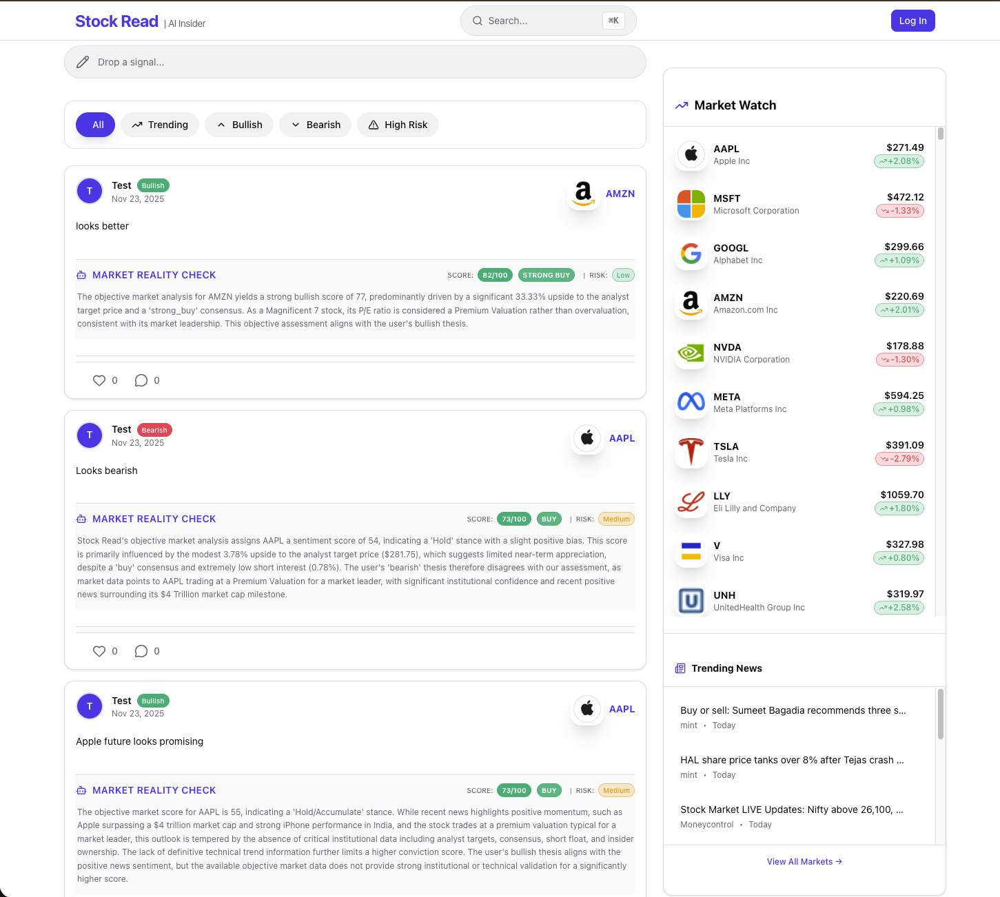

# Stock Read

**AI-Powered Social Investment Intelligence Platform**

Stock Read is a next-generation social trading platform that combines real-time market data, institutional-grade AI analysis, and community-driven investment insights. Built for retail investors who demand professional-quality analysis without the institutional price tag.

**Live URL:** [https://stock-read.vercel.app/](https://stock-read.vercel.app/)

---



---

## Overview

Stock Read bridges the gap between social investment communities and professional financial analysis. Users share investment theses, while our AI-powered Global Analyst provides objective market reality checks using real-time data from Wall Street's institutional sources.

### Key Differentiators

- **Objective AI Analysis**: Separate user sentiment from market reality with AI-generated sentiment scores (0-100)
- **Institutional-Grade Metrics**: ROE, profit margins, growth rates, analyst consensus, target prices, insider ownership
- **Real-Time Market Data**: Live price updates, technical indicators (RSI, MACD, Bollinger Bands), and news sentiment
- **Sector-Relative Valuation**: Context-aware scoring that understands tech stocks trade differently than utilities
- **Community Intelligence**: See what the community thinks vs. what institutional data suggests

---

## Core Features

### 1. Social Investment Platform
- Share bullish/bearish investment theses on any US-listed stock
- Follow other investors and track their performance
- Real-time feed with infinite scroll and optimistic UI updates
- Comment and engage with community analysis

### 2. AI Market Analyst
- **Sentiment Scoring (0-100)**: Objective market strength assessment
- **Risk Classification**: Low, Medium, High, Extreme risk levels
- **Market Reality Check**: AI compares user thesis to institutional data
- **Enhanced Analysis**: Incorporates 20+ fundamental, technical, and institutional metrics

### 3. Live Market Dashboard
- Real-time stock prices with WebSocket updates
- Horizontal scrolling ticker for mobile optimization
- Integrated news feed from major financial outlets
- Market sentiment indicators (VIX, market mood)

### 4. Advanced Stock Analysis
- Interactive candlestick charts with technical overlays
- Fundamental metrics: P/E, PEG, ROE, profit margins, debt ratios
- 52-week range analysis with momentum indicators
- Analyst consensus and target price tracking
- Institutional ownership and short interest data

### 5. Global Search
- Instant search across stocks, users, and posts
- Smart command palette with keyboard shortcuts (Cmd+K)
- Recent searches and trending tickers

### 6. User Profiles
- Customizable profiles with avatar upload
- Post history and performance tracking
- Follower/following system
- Dark/light theme support

---

## Technology Stack

### Frontend
- **Framework**: Next.js 16 (App Router with React Server Components)
- **Language**: TypeScript 5
- **Styling**: Tailwind CSS 4
- **UI Components**: Radix UI primitives with custom design system
- **State Management**: React Server Actions for mutations, Intersection Observer for infinite scroll
- **Charts**: Recharts for interactive financial visualizations
- **Real-time**: Supabase Realtime for live price updates
- **Deployment**: Vercel (Edge Network)

### Backend Services
- **Language**: Python 3.14
- **Framework**: FastAPI with Uvicorn
- **AI/ML**: Google Gemini 2.5 Flash for market analysis
- **Data Sources**: 
  - yfinance for market data
  - Google News for sentiment analysis
  - StockTwits for social sentiment (optional)
- **Technical Analysis**: pandas-ta (RSI, MACD, Bollinger Bands)
- **Scheduling**: pytz for market hours detection
- **Caching**: Redis for API response caching (60s TTL for prices, 5min for technicals)

### Database & Infrastructure
- **Database**: Supabase (PostgreSQL)
- **Authentication**: Supabase Auth with Row Level Security (RLS)
- **Storage**: Supabase Storage for user avatars
- **Real-time**: Supabase Realtime subscriptions
- **Hosting**: 
  - Frontend: Vercel
  - Backend: Render.com (or similar PaaS)
  - Database: Supabase Cloud

---

## Architecture

### System Overview

Stock Read follows a **hybrid architecture** combining server-side rendering (SSR) with client-side interactivity and background AI services.


### Background Services

The platform runs 5 autonomous background services:

1. **Global Analyst**: Analyzes user-tracked stocks 3x daily during market hours (10 AM, 12 PM, 2:30 PM ET)
2. **Market Maker**: Provides real-time price updates and maintains market data cache
3. **Response Bot**: Automatically engages with high-quality user posts (optional)
4. **News Service**: Fetches and updates market news hourly
5. **Maintenance Service**: Cleans up stale data and optimizes database performance

---

## AI Analysis System

### Enhanced AI v2.0 (November 2025)

Stock Read's AI uses a sophisticated multi-factor scoring system that rivals institutional analysis platforms.

#### Data Sources (20+ Metrics)

**Fundamental Metrics:**
- Valuation: P/E, Forward P/E, PEG, P/B, EV/Revenue, EV/EBITDA
- Profitability: ROE, ROA, Net Margin, Operating Margin
- Growth: Revenue Growth, Earnings Growth (YoY)
- Financial Health: Debt/Equity, Current Ratio, Quick Ratio

**Technical Indicators:**
- Trend Analysis: SMA (20/50), MACD (12/26/9), Bollinger Bands
- Momentum: RSI (14), MACD Histogram
- Price Action: 52-week high/low distance, volume trends

**Institutional Data:**
- Analyst Consensus: Buy/Hold/Sell recommendations
- Target Price: Mean, high, low analyst targets
- Ownership: Insider holdings, institutional holdings
- Short Interest: Short float percentage, short ratio

**Macro Context:**
- VIX (Market Fear Index)
- Sector classification
- Industry positioning

#### Scoring Logic

**Weighting System:**
- Institutional/Consensus: 40% (Primary Driver)
- Technicals: 25%
- News Sentiment: 20%
- Fundamentals: 15%

**Special Rules:**

1. **Target Price Upside Rule** (Primary Driver):
   - 15%+ below target = 70-85 (Strong Buy)
   - 10-15% below = 65-75 (Buy)
   - 5-10% below = 55-65 (Hold)
   - At/above target = 40-55 (Hold/Trim)

2. **Magnificent 7 Premium Valuation**:
   - AAPL, NVDA, MSFT, AMZN, GOOGL, META, TSLA
   - P/E 25-50 considered normal if consensus is Buy
   - Uses "Premium Valuation" terminology, not "Overvaluation"

3. **Growth vs. Value Logic**:
   - Growth stocks (Revenue Growth >20%): Evaluated on Forward P/E, PEG ratio
   - Value stocks (P/E <15, Yield >3%): Focus on ROE, balance sheet, dividend sustainability

4. **Sector-Relative Benchmarks**:
   - Technology: P/E 20-35 normal
   - Healthcare: P/E 15-25 normal
   - Utilities/REITs: Focus on yield (3-5%)
   - Financials: Use P/B ratio (<1.5 target)

5. **Technical Confluence**:
   - Uptrend + MACD Bullish + RSI 40-60 = +10 points
   - Near 52W high + RSI <70 = Bullish breakout (+10 points)
   - Near 52W low + Positive consensus = Deep value (+15 points)

6. **Risk Assessment**:
   - VIX >30 = Reduce bullish scores 10-15 points (except defensive sectors)
   - Short float >20% = High volatility flag
   - Debt/Equity >2.0 = Financial risk (-5 points)

#### Output Format

```json
{
  "sentiment_score": 73,
  "risk_level": "Medium",
  "user_thesis": "Bullish",
  "summary": "Score of 73 (Buy) driven by analyst 'buy' consensus with 3.8% target upside. Exceptional profitability (ROE 171%, Earnings Growth 91%) justifies premium valuation. Trading 2.1% below 52W high.",
  "tags": ["Technology", "Buy", "Premium Valuation", "Magnificent 7"]
}
```

---

## Database Schema

### Core Tables

**posts**
```sql
- id (uuid, primary key)
- user_id (uuid, foreign key to profiles)
- ticker (text)
- user_post_text (text)
- signal (text: 'Bullish', 'Bearish', 'Neutral')
- author_username (text, denormalized)
- author_avatar (text, denormalized)
- raw_market_data (jsonb)
- price_history (jsonb)
- like_count (integer)
- comment_count (integer)
- created_at (timestamp)
```

**ticker_insights**
```sql
- ticker (text, primary key)
- ai_score (integer, 0-100)
- ai_signal (text: 'Strong Buy', 'Buy', 'Hold', 'Sell', 'Strong Sell')
- ai_risk (text: 'Low', 'Medium', 'High', 'Extreme')
- ai_summary (text)
- current_price (float)
- market_cap (text)
- pe_ratio (float)
- analyst_rating (text)
- target_price (float)
- short_float (float)
- insider_held (float)
- roe (float)
- profit_margin (float)
- revenue_growth (float)
- earnings_growth (float)
- debt_to_equity (float)
- current_ratio (float)
- dividend_yield (float)
- payout_ratio (float)
- week_52_high (float)
- week_52_low (float)
- sector (text)
- industry (text)
- vix (float)
- market_sentiment (text)
- updated_at (timestamp)
```

**profiles**
```sql
- id (uuid, primary key, foreign key to auth.users)
- username (text, unique)
- display_name (text)
- bio (text)
- avatar_url (text)
- follower_count (integer)
- following_count (integer)
- post_count (integer)
- created_at (timestamp)
- updated_at (timestamp)
```

**follows**
```sql
- id (uuid, primary key)
- follower_id (uuid, foreign key to profiles)
- following_id (uuid, foreign key to profiles)
- created_at (timestamp)
- unique constraint on (follower_id, following_id)
```

**likes**
```sql
- id (uuid, primary key)
- post_id (uuid, foreign key to posts)
- user_id (uuid, foreign key to profiles)
- created_at (timestamp)
- unique constraint on (post_id, user_id)
```

**comments**
```sql
- id (uuid, primary key)
- post_id (uuid, foreign key to posts)
- user_id (uuid, foreign key to profiles)
- content (text)
- created_at (timestamp)
```

---

## Setup Instructions

### Prerequisites

- Node.js 18+ and npm/yarn
- Python 3.13 or 3.14
- Supabase account
- Google Gemini API key
- Redis instance (optional, for caching)

### Environment Variables

**Frontend (.env.local)**
```env
NEXT_PUBLIC_SUPABASE_URL=your_supabase_url
NEXT_PUBLIC_SUPABASE_ANON_KEY=your_anon_key
SUPABASE_SERVICE_ROLE_KEY=your_service_role_key
```

**Backend (.env)**
```env
SUPABASE_URL=your_supabase_url
SUPABASE_KEY=your_service_role_key
GOOGLE_API_KEY=your_gemini_api_key
REDIS_URL=redis://localhost:6379 (optional)
PORT=8000
```

### Installation

**1. Clone the repository**
```bash
git clone https://github.com/yourusername/stock-read.git
cd stock-read
```

**2. Set up the frontend**
```bash
cd frontend
npm install
cp .env.example .env.local
# Edit .env.local with your Supabase credentials
npm run dev
```
Frontend will run on http://localhost:3000

**3. Set up the backend**
```bash
cd ..
python3 -m venv venv
source venv/bin/activate  # On Windows: venv\Scripts\activate
pip install -r requirements.txt
cp .env.example .env
# Edit .env with your credentials
python main.py
```
Backend will run on http://localhost:8000

**4. Set up the database**
```bash
# Run migrations in Supabase SQL Editor
# Execute files in database_migrations/ folder in order:
# 1. create_ticker_insights_table.sql
# 2. enable_delete_policies.sql
```

**5. Start background services** (Optional)
```bash
# Services are automatically started by main.py
# Or run individually:
python services/global_analyst.py
python services/market_maker_service.py
```

---

## Project Structure

```
stock-read/
├── frontend/                    # Next.js frontend application
│   ├── app/                     # Next.js 16 App Router
│   │   ├── actions/             # Server Actions for mutations
│   │   ├── api/                 # API routes
│   │   ├── login/               # Authentication page
│   │   ├── markets/             # Market dashboard
│   │   ├── profile/             # User profiles
│   │   ├── settings/            # User settings
│   │   ├── ticker/              # Stock detail pages
│   │   ├── layout.tsx           # Root layout
│   │   └── page.tsx             # Home feed
│   ├── components/              # React components
│   │   ├── features/            # Feature-specific components
│   │   └── ui/                  # Reusable UI components
│   ├── lib/                     # Utility libraries
│   │   ├── supabase-client.ts   # Client-side Supabase
│   │   ├── supabase-server.ts   # Server-side Supabase
│   │   └── utils.ts             # Helper functions
│   └── types/                   # TypeScript type definitions
├── services/                    # Python backend services
│   ├── ai_service.py            # Gemini AI integration
│   ├── market_service.py        # Market data fetching
│   ├── global_analyst.py        # Batch AI analysis
│   ├── market_maker_service.py  # Real-time price updates
│   ├── news_service.py          # News aggregation
│   ├── response_bot_service.py  # Auto-engagement bot
│   ├── maintenance_service.py   # Database maintenance
│   └── db_service.py            # Database utilities
├── database_migrations/         # SQL migrations
│   ├── create_ticker_insights_table.sql
│   └── enable_delete_policies.sql
├── main.py                      # FastAPI application entry
├── requirements.txt             # Python dependencies
└── README.md                    # This file
```

---

## API Documentation

### REST Endpoints

**GET /api/stocks**
```typescript
// Search stocks by symbol or name
// Query params: q (search term)
// Returns: Array of stock matches
```

**GET /healthz**
```typescript
// Health check for backend services
// Returns: { status: "ok", healthy: true }
```

### Server Actions (Next.js)

**createPost(formData)**
```typescript
// Create a new investment signal
// Triggers AI analysis automatically
// Returns: Created post with AI insights
```

**fetchPosts(offset, filter, ticker)**
```typescript
// Fetch paginated posts with filters
// Supports: All, Trending, Bullish, Bearish, High Risk
// Returns: Array of posts with live insights
```

**getStockDetails(ticker)**
```typescript
// Fetch comprehensive stock analysis
// Returns: Market data, technicals, news, AI insights
```

**getChartData(ticker, interval)**
```typescript
// Fetch historical price data for charts
// Supports: 1D, 5D, 1M, 3M, 6M, 1Y, 5Y
// Returns: OHLCV data for Recharts
```

---

## Performance Optimizations

1. **Caching Strategy**:
   - Redis caching for market data (60s TTL)
   - Technical analysis cached (5min TTL)
   - Denormalized user data in posts table

2. **Database Optimization**:
   - Indexed columns: ticker, user_id, created_at
   - Materialized views for trending posts
   - Row Level Security (RLS) for data isolation

3. **Frontend Optimization**:
   - React Server Components for SSR
   - Intersection Observer for infinite scroll
   - Optimistic UI updates for instant feedback
   - Code splitting and lazy loading

4. **Real-time Updates**:
   - Supabase Realtime for live price updates
   - WebSocket connections for market data
   - Selective subscriptions to reduce bandwidth

---

## Deployment

### Frontend (Vercel)
```bash
cd frontend
vercel --prod
```

### Backend (Render.com)
```bash
# Create render.yaml in project root
# Or use Render dashboard to deploy main.py
```

### Environment Configuration
- Set all environment variables in deployment platform
- Enable automatic deployments from main branch
- Configure custom domain (optional)

---

## Contributing

Contributions are welcome. Please follow these guidelines:

1. Fork the repository
2. Create a feature branch (`git checkout -b feature/amazing-feature`)
3. Commit changes (`git commit -m 'Add amazing feature'`)
4. Push to branch (`git push origin feature/amazing-feature`)
5. Open a Pull Request

### Code Standards
- Frontend: Follow Next.js and React best practices
- Backend: PEP 8 for Python code
- Types: Use TypeScript for all frontend code
- Testing: Add tests for new features (TBD)

---

## Roadmap

### Phase 1 (Current)
- Core social features
- AI analysis v2.0
- Real-time market data
- Mobile optimization

### Phase 2 (Q1 2026)
- Portfolio tracking
- Performance leaderboards
- Advanced filtering and search
- Options flow data integration

### Phase 3 (Q2 2026)
- Paper trading simulation
- Email/push notifications
- Mobile apps (iOS/Android)
- Premium subscription tier

### Phase 4 (Q3 2026)
- Broker integration
- Live audio rooms
- Educational content
- API for developers

---

## License

This project is proprietary and confidential. All rights reserved.

For licensing inquiries, contact: [zayeemzaki45@gmail.com]

---

## Acknowledgments

- Google Gemini for AI capabilities
- Supabase for backend infrastructure
- Vercel for frontend hosting
- yfinance for market data
- The open-source community


---

**Built with precision. Powered by AI.**

Stock Read - Because every investor deserves institutional-grade analysis.
**visit:** [https://zayeemzaki.com](https://zayeemzaki.com)

